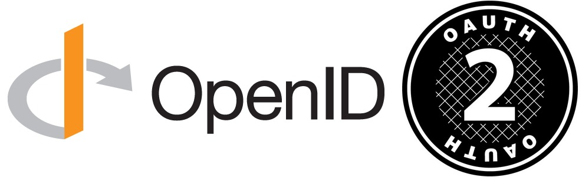
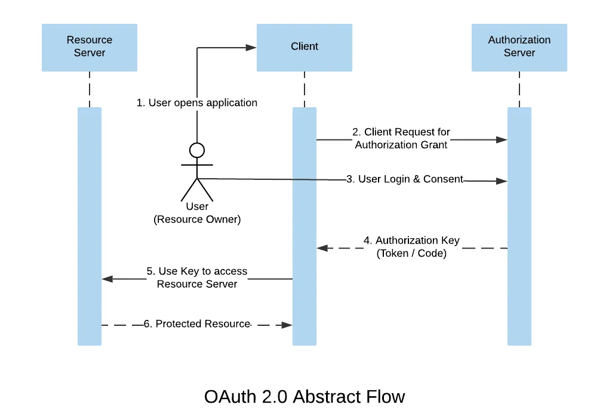
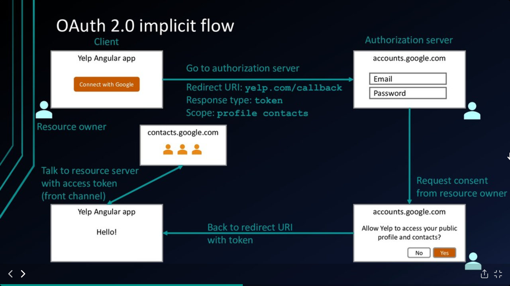
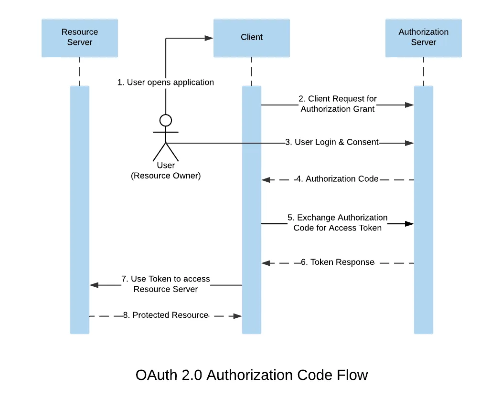
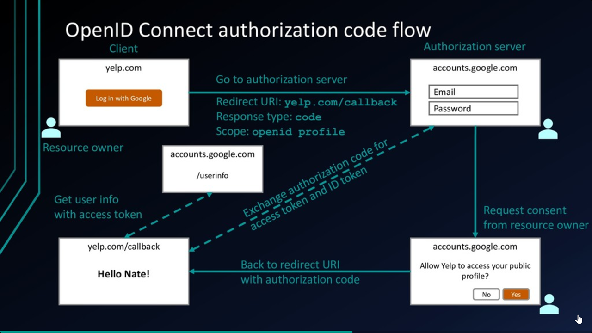

# OpenID Connect and OAuth2 for the beginner



Auth 2.0 and OpenID Connect (OIDC), which are the standard protocols that most authentication and authorization solutions are based on

* The OpenID Connect (OIDC) protocol is built on the OAuth 2.0 protocol and helps authenticate users and convey information about them. It's also more opinionated than plain OAuth 2.0, for example in its scope definitions.

* The OAuth 2.0 protocol controls authorization to access a protected resource, like your web app, native app, or API service.

The OAuth 2.0 protocol provides API security through scoped access tokens. OAuth 2.0 enables you to delegate authorization, while OIDC enables you to retrieve and store authentication information about your end users. OIDC extends OAuth 2.0 by providing user authentication and single sign-on (SSO) functionality.

## OAuth 2.0

Understanding this protocol requires us to understand its terminology:

* Resource Owner: The user who owns the data that the client application wants to access.
* Client: The application that wants access to the user’s data.
* Authorization Server: The authorization server authorizes the client to access a user’s data by granting permission from the user.
* Resource Server: The system that holds the data that the client wants to access. In some cases, the resource server and authorization server are the same.
* Access Token: An access token is the only key that the client can use to access the granted data by the user on the resource server.

Take a look at this terminology in the OAuth 2.0 abstract flow:



1. The user (want to access client application) starts the authorization flow, usually by clicking a button like Connect with Google or Facebook or any other service.

2. The client then redirects the user to the authorization server. While redirecting the client sends information such as the client id and the redirect URI.

3. The authorization server handles user authentication and shows a consent screen, granting permission from the user. If you’re signing in with Google you have to provide your login credentials to Google — i.e. accounts.google.com and not the client.
4. If the user grants permission, the authorization server redirects the user to the client with the authorization key (code/token).
5. The client then requests the resource server with the authorization key included, asking the resource server to respond with the user’s data.
6. The resource server then validates the authorization key and responds with the requested data to the client.



That’s how users give third-party applications access to their data without giving them the password. At this point, the following questions arise:

How do we limit the client to access only some part of our data on the resource server?
What if we want the client to only read our data and not change it?
These questions take us to another important piece of OAuth terminology: <b>scopes</b>.

### Scopes in OAuth
Scopes in OAuth 2.0 are used to limit an application’s access to a user’s data. By issuing an authorization grant that is limited only to the scopes granted by the user.

When the client makes a request to the authorization server for authorization grant, it sends a list of scopes with it. The authorization server uses this list of scopes to generate a consent screen and grants permission from the user. If the user agrees to the consent screen, the authorization server issues a token or authorization code that is limited only to the scopes

### Authorization code flow
The authorization code flow or authorization code grant is an ideal OAuth flow which is considered to be highly secured because it uses both the front-end channel (browser) and the backend-channel (server) to implement the OAuth 2.0 mechanism.


The client begins the authorization sequence by redirecting the user to the authorization server with response_type set to code this tells the authorization server to respond with an authorization code. The URI for this flow looks like this:
```
https://accounts.google.com/o/oauth2/v2/auth?
 response_type=code&
 client_id=your_client_id&
 scope=profile%20contacts&
 redirect_uri=https%3A//oauth2.example.com/code
```

Why exchange code for a token?

<b>Problem:</b> An access token is a secret piece of information that we don’t want someone to access. If the client requests an access token directly and stores it in the browser, it can be stolen because browsers are not fully secure. Anyone can see the page source or potentially use dev tools to acquire the access token.

<b>Solution:</b> To avoid exposure of the access token in the browser, the front end channel of the client gets the authorization code from the authorization server, then it sends the authorization code to the client’s back end channel. Now to exchange this authorization code for an access token, a thing called client_secret is needed. The client_secret is only known by the client’s back-end channel, the back-end channel then makes a POST request to the authorization server with authorization code and client secret included. The request might look something like this:

```
POST /token HTTP/1.1
Host: oauth2.googleapis.com
Content-Type: application/x-www-form-urlencoded
code=4/W7q7P51a-iMsCeLvIaQc6bYrgtp9&
client_id=your_client_id&
client_secret=your_client_secret_only_known_by_server&
redirect_uri=https%3A//oauth2.example.com/code
```

The authorization server validates the client secret and authorization code and responds with an access token. The back end channel stores the access token and potentially use this token to access a resource server. In this way, the browser cannot access the access token.

## OpenID Connect

OpenID Connect is an identity layer on top of the OAuth 2.0 protocol. It extends OAuth 2.0 to standardize a way for authentication.

OAuth does not provide user identity right away but rather it provides an access token for authorization. OpenID Connect enables the client to identify the user based on the authentication performed by the authorization server. This is achieved by defining a scope named openid when requesting the authorization server for user login and consent. openid is a mandatory scope to tell the authorization server that OpenID Connect is required.

The URI for OpenID Connect authentication request made by the client looks like this:

```
https://accounts.google.com/o/oauth2/v2/auth?
 response_type=code&
 client_id=your_client_id&
 scope=openid%20contacts&
 redirect_uri=https%3A//oauth2.example.com/code
```

The result of the request is an authorization code that the client can exchange for an access token and ID token. If the OAuth flow is implicit then the authorization server responds with an access token and an ID token right away.

The ID token is a JWT or JSON Web Token. A JWT is an encoded token that consists of three parts: header, payload, and signature. After acquiring the ID token, the client can decode it to get the user info encoded in the payload part — like this:

```json
{
  "iss": "https://accounts.google.com",
  "sub": "10965150351106250715113082368",
  "email": "johndoe@example.com",
  "iat": 1516239022,
  "exp": 1516242922
}
```

### Claims
The payload of the ID token contains some fields known as claims. Basic claims are:

* iss token issuer.
* sub unique identifier for the user.
* email user’s email.
* iat token issuing time represented as Unix time.
* exp token expiration time represented as Unix time.

However, claims are not limited to these fields. It’s up to the authorization server to encode claims. The client can use this information to authenticate the user.

If the client needs more user information, the client can specify standard OpenID Connect scopes to tell the authorization server to include the required information in the ID token’s payload. These scopes are profile, email, address, and phone.




